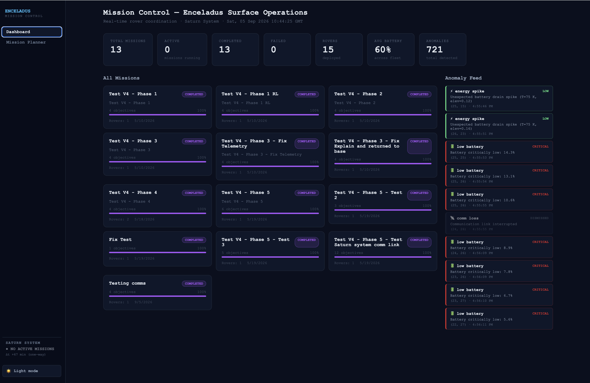
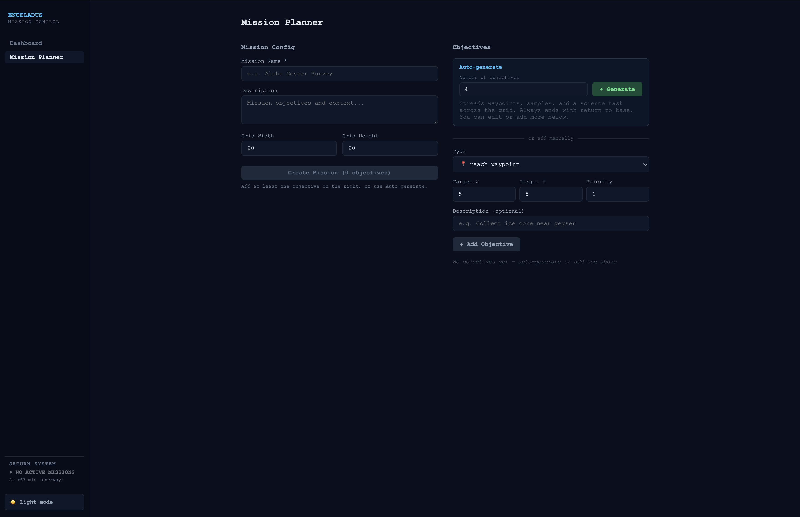
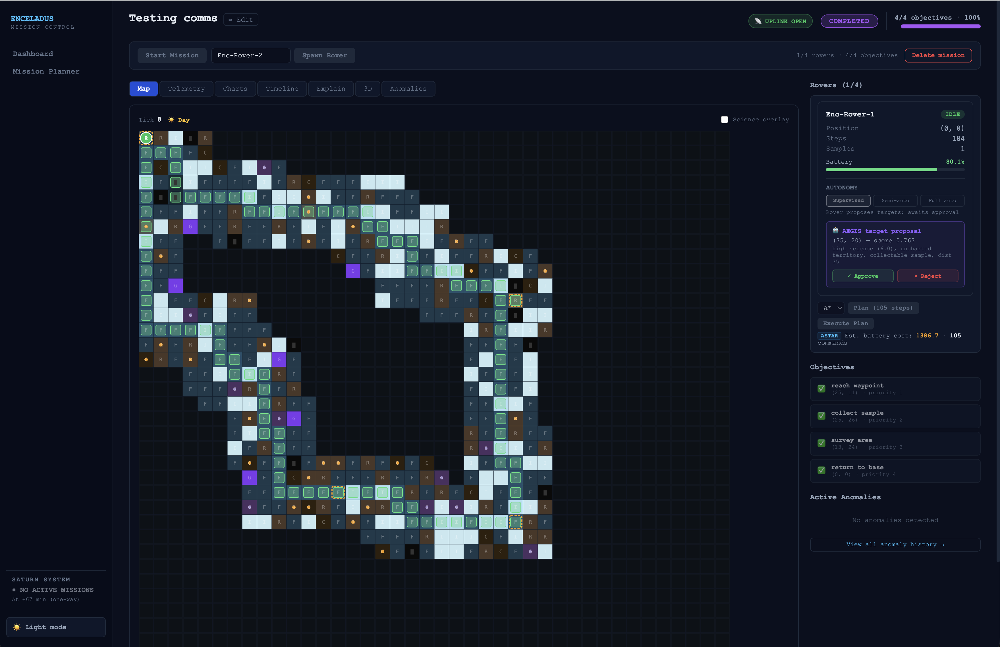
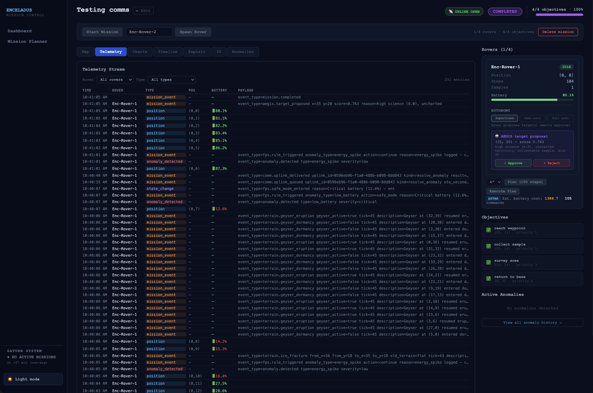
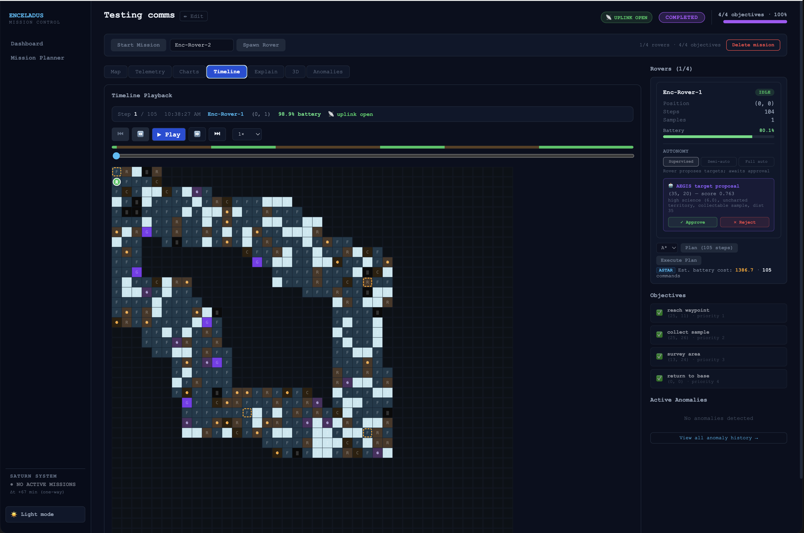
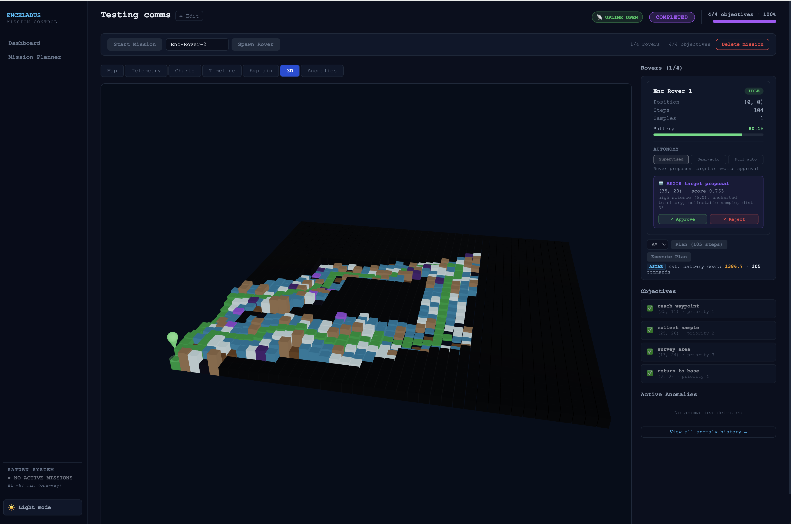
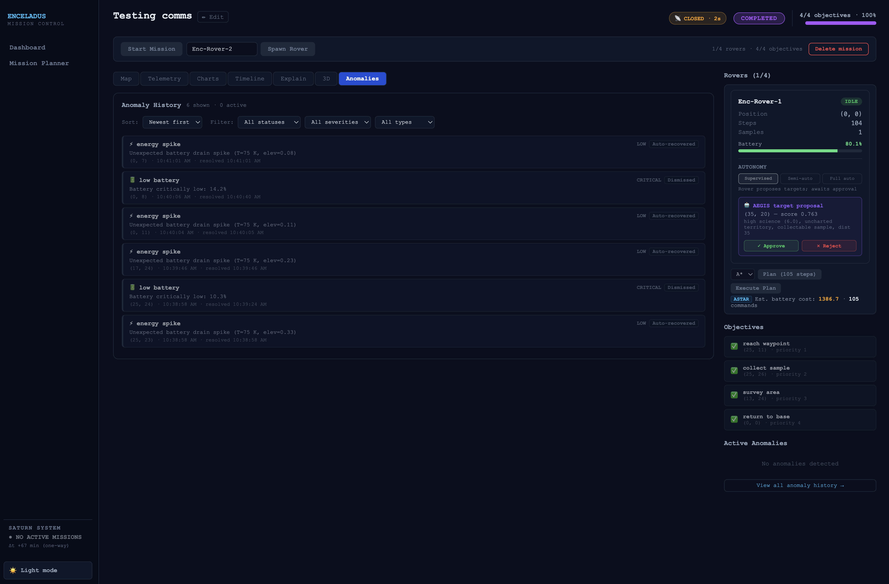
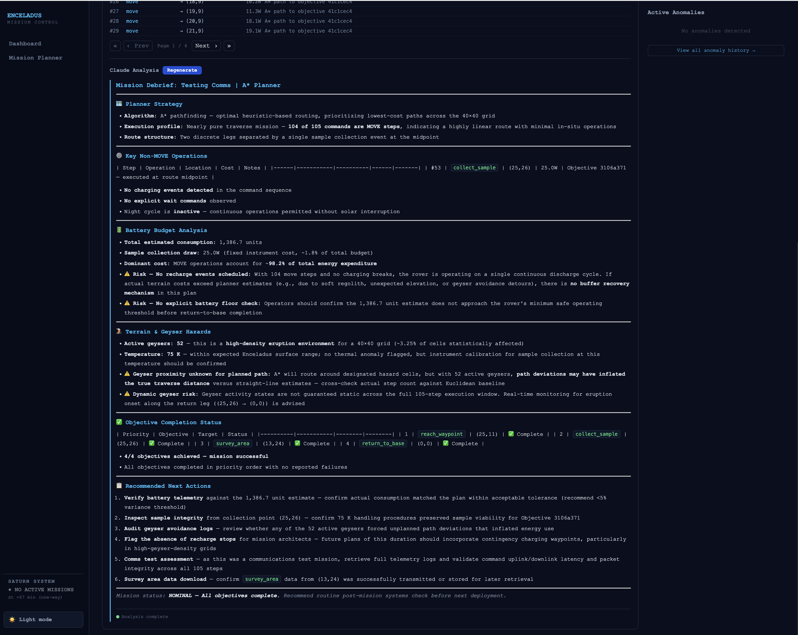

# Enceladus Mission Control Center

[](https://www.python.org/)
[](https://fastapi.tiangolo.com/)
[](https://react.dev/)
[](https://www.typescriptlang.org/)
[](https://threejs.org/)
[](https://www.postgresql.org/)
[](https://redis.io/)
[](https://www.docker.com/)
[](https://docs.astral.sh/uv/)
[](https://www.anthropic.com/)
[](LICENSE)

**A production-grade simulation of an autonomous space mission control system for rover operations on Enceladus, Saturn's ocean moon.**

The project combines **digital twins, autonomous mission planning, multi-agent coordination, reinforcement learning, fault protection, delayed communications, real-time telemetry, and AI-assisted explainability** in a full-stack mission-control environment.

It is designed as an educational and portfolio project exploring how software architectures for future autonomous planetary missions might be built.

---

## Highlights

- 🛰️ Mission control for simulated Enceladus rover operations
- 🤖 Autonomous rover planning using **A\*** and **reinforcement learning**
- 🧠 **Multi-agent coordination** for distributing mission objectives across multiple rovers
- 🌐 Physics-aware **digital twin** simulation
- 🛡️ Autonomous fault detection, protection, and recovery
- 🔭 **AEGIS-style science autonomy** for self-directed target selection
- 🌋 Dynamic terrain with geysers, ice fractures, frost cycles, and fog of war
- 📡 Communication windows with delayed command uplink
- 📊 Real-time telemetry over WebSockets
- 🧠 Claude-powered mission, plan, and anomaly explanations
- 🗺️ Interactive 2D and 3D mission visualization
- ⏱️ Timeline playback and mission debriefing
- 🐳 Production-like local stack with Docker Compose, PostgreSQL, and Redis

---

## Mission Control UI

### Dashboard

The main dashboard provides an operational overview of the current mission, rover state, objectives, telemetry, and environment.

<p align="center">
  
</p>

### Mission Planner

Mission objectives can be translated into rover plans using classical A\* pathfinding or reinforcement-learning-based planning.

<p align="center">
  
</p>

### Mission Map

The mission map visualizes rover position, terrain, objectives, hazards, exploration state, and planned movement.

<p align="center">
  
</p>

### Real-Time Telemetry

Mission execution produces a continuous telemetry stream that can be inspected during rover operations.

<p align="center">
  
</p>

### Timeline Playback

Recorded mission events can be replayed to inspect how the rover, environment, telemetry, and autonomous decisions evolved over time.

<p align="center">
  
</p>

### 3D Mission Plan

The frontend uses Three.js and React Three Fiber to provide an interactive 3D representation of the simulated terrain and rover mission plan.

<p align="center">
  
</p>

### Anomaly History

Detected failures and autonomous recovery actions are recorded for operational inspection and mission analysis.

<p align="center">
  
</p>

### AI-Assisted Debriefing

Claude can produce natural-language explanations of mission plans, anomalies, and mission outcomes using the system's structured decision history.

<p align="center">
  
</p>

---

## Overview

Long-distance planetary missions cannot depend on continuous human control.

A rover operating on a distant world must be able to:

- interpret high-level mission objectives;
- plan feasible routes;
- react to hazards and failures;
- make local autonomous decisions;
- continue operating when communication with Earth is unavailable;
- expose enough telemetry and reasoning for mission controllers to understand what happened.

**Enceladus Mission Control Center** models those concerns as a complete software system.

The repository combines mission-control software, autonomous planning, a digital-twin simulation, event-driven telemetry, delayed communications, multi-rover coordination, science autonomy, and AI-assisted explainability.

The goal is not to reproduce a specific real-world spacecraft implementation. It is to provide a realistic engineering playground for exploring **space robotics, autonomous systems, agentic architectures, mission planning, and digital twins**.

---

## Autonomous Mission Architecture

At a high level, mission objectives flow through planning and coordination into autonomous rover execution.

```text
                    ┌───────────────────────┐
                    │   Mission Objectives  │
                    └───────────┬───────────┘
                                │
                                ▼
                    ┌───────────────────────┐
                    │    Mission Planning   │
                    │      A*  /  RL        │
                    └───────────┬───────────┘
                                │
                                ▼
                    ┌───────────────────────┐
                    │ Multi-Agent           │
                    │ Coordination          │
                    └───────────┬───────────┘
                                │
                                ▼
                    ┌───────────────────────┐
                    │ Rover Digital Twins   │
                    └───────────┬───────────┘
                                │
                                ▼
                    ┌───────────────────────┐
                    │ Autonomous Execution  │
                    └───────────┬───────────┘
                                │
              ┌─────────────────┼──────────────────┐
              │                 │                  │
              ▼                 ▼                  ▼
       Fault Protection     AEGIS-style       Dynamic
       & Recovery           Science           Replanning
                            Autonomy
              │                 │                  │
              └─────────────────┼──────────────────┘
                                │
                                ▼
                    ┌───────────────────────┐
                    │ Environment / Terrain │
                    │      Simulation       │
                    └───────────┬───────────┘
                                │
                                ▼
                    ┌───────────────────────┐
                    │ Telemetry & Events    │
                    └───────────┬───────────┘
                                │
                                ▼
                    ┌───────────────────────┐
                    │    Mission Control    │
                    │  UI / API / Timeline  │
                    └───────────────────────┘
```

This architecture allows the same mission to be studied from several perspectives:

- **planning** — how should a rover reach its objectives?
- **coordination** — how should work be divided across multiple rovers?
- **autonomy** — what should happen when Earth is unavailable?
- **resilience** — how should the rover respond to failures?
- **simulation** — how does the environment evolve?
- **operations** — what information should mission control receive?
- **explainability** — can autonomous decisions be reconstructed and explained?

---

## Key Capabilities

### Digital Twin Simulation

Each rover is represented by a digital twin containing state such as:

- position;
- battery;
- operational state;
- path history;
- assigned plan;
- mission relationship.

The simulation engine executes rover plans against the generated Enceladus environment and produces telemetry events as the rover moves, samples targets, waits, charges, or encounters anomalies.

The environment models more than a static grid. Mission execution can be affected by changing terrain and environmental conditions.

---

### A* Mission Planning

The classical planner uses A\* search to generate paths through the environment while taking terrain and movement cost into account.

A\* provides a deterministic planning baseline that is useful for:

- validating environment constraints;
- comparing planning strategies;
- generating predictable routes;
- testing replanning behavior.

---

### Reinforcement-Learning Planning

The system also includes a reinforcement-learning-based planner.

This provides an alternative to purely deterministic graph search and allows the project to explore how learned value functions can influence autonomous mission planning.

The intent is not to claim that RL is always superior to A\*. Instead, the two approaches provide useful contrasting planning strategies inside the same mission-control architecture.

---

### Multi-Agent Rover Coordination

When multiple rovers participate in the same mission, objectives can be distributed across them.

The coordination layer considers the mission's objectives and available rovers, then produces rover-specific planning work.

Conceptually:

```text
Mission Objectives
        │
        ▼
Objective Distribution
   ┌────┼────┐
   │    │    │
   ▼    ▼    ▼
Rover A B    C
   │    │    │
   ▼    ▼    ▼
 Plan Plan Plan
```

This turns the system from a single-robot simulator into a small **multi-agent mission execution environment**.

---

### Autonomous Fault Protection

A distant rover cannot wait for a human operator every time something goes wrong.

The fault-protection subsystem detects anomalies and can trigger autonomous responses such as:

- retrying an operation;
- reversing;
- replanning;
- entering a safe state.

Fault handling is recorded in the telemetry/event history so that controllers can later reconstruct why the system responded in a particular way.

---

### AEGIS-Style Science Autonomy

The project includes an AEGIS (Autonomous Exploration for Gathering Increased Science) inspired autonomous science capability.

When operating with sufficient autonomy, a rover can evaluate science-value information and generate new objectives after its assigned work is complete.

This models a useful concept in future robotic exploration: rather than treating the rover purely as a remotely operated vehicle, the rover can make bounded local decisions about what is scientifically interesting.

---

### Dynamic Enceladus Environment

The simulated environment is designed to evolve during the mission.

It includes concepts such as:

- geyser activity;
- ice fractures;
- day/night frost cycles;
- temperature and pressure effects;
- terrain movement costs;
- hazards;
- science-value information;
- fog of war.

The rover therefore operates in an environment that is not completely known or static.

---

### Fog of War

Cells can initially be unrevealed and become known through exploration.

This allows planning and autonomy to operate under incomplete knowledge rather than assuming that the entire environment is available from the beginning.

---

### Communication Windows

The mission includes constrained communication between ground control and the rover.

Commands issued while a communication window is closed can be queued for a later uplink.

This introduces an important autonomous-systems constraint:

```text
Ground Command
      │
      ▼
Comm Window Open?
   │         │
  Yes        No
   │         │
   ▼         ▼
Apply      Queue
Command    Command
             │
             ▼
       Next Uplink Window
```

The rover must therefore be capable of continuing local execution without assuming permanent connectivity to Earth.

---

### Real-Time Telemetry

Telemetry events are streamed to the frontend using WebSockets.

Mission controllers can observe:

- rover state;
- mission progress;
- plan execution;
- anomalies;
- environment events;
- autonomous decisions.

Event history is also retained so that live operations and post-mission analysis use the same underlying event stream.

---

### Timeline Playback

Recorded mission activity can be replayed through the timeline UI.

This is particularly useful for:

- debugging;
- autonomy evaluation;
- anomaly investigation;
- mission debriefing;
- understanding the ordering of environmental and rover events.

---

### AI-Assisted Explainability

The system produces structured decision information independently of any LLM.

When an Anthropic API key is configured, Claude can use that structured context to generate human-readable explanations for:

- mission plans;
- mission outcomes;
- anomalies;
- autonomous decisions.

LLM output is therefore used as an **explanation layer**, not as the sole source of mission-control truth.

Streaming explanations are delivered using Server-Sent Events.

---

## System Architecture

```text
┌──────────────────────────────────────────────────────────────────────┐
│                         Frontend (React + TS)                         │
│                                                                      │
│ Dashboard · Planner · Map · 3D · Telemetry · Timeline · Debriefing   │
└───────────────────────────┬──────────────────────────────────────────┘
                            │
                     REST / WebSocket / SSE
                            │
┌───────────────────────────▼──────────────────────────────────────────┐
│                         FastAPI Backend                              │
│                                                                      │
│  Mission Service       Planning Service       Simulation Service     │
│  Mission lifecycle     A* / RL planning       Rover digital twins    │
│                        Multi-agent coord.      Environment execution  │
│                                                                      │
│  Telemetry Service     Explainability         Communication Service  │
│  WebSocket events      Structured decisions   Comm windows           │
│  Event history         Claude streaming       Uplink queue           │
│                                                                      │
│  ┌────────────────────────────────────────────────────────────────┐  │
│  │                        Event Bus                               │  │
│  │       In-memory implementation → Redis Streams                │  │
│  └────────────────────────────────────────────────────────────────┘  │
└───────────────────────┬───────────────────────────┬───────────────────┘
                        │                           │
                        ▼                           ▼
                     Redis                     PostgreSQL
                  Event Streams                Persistence
```

### Core Services

| Service | Responsibility |
|---|---|
| Mission service | Mission lifecycle, objectives, rover relationships, environment generation |
| Planning service | A\*, RL planning, multi-agent objective distribution |
| Simulation service | Rover digital twins, plan execution, anomalies, environment evolution |
| Telemetry service | Real-time WebSocket telemetry and event history |
| Explainability service | Structured decision records and Claude-powered explanations |
| Communication service | Communication windows and queued uplink commands |

---

## Technology Stack

| Layer | Technology |
|---|---|
| Backend | Python 3.12, FastAPI, Pydantic |
| Simulation | NumPy, custom digital-twin and environment simulation |
| Planning | A\*, reinforcement learning, multi-agent coordination |
| AI explainability | Anthropic Claude |
| Persistence | PostgreSQL, SQLAlchemy, Alembic |
| Event streaming | Redis Streams |
| Real-time communication | WebSockets, Server-Sent Events |
| Frontend | React 18, TypeScript, Vite |
| 3D visualization | Three.js, React Three Fiber, Drei |
| Frontend state/data | Zustand, TanStack Query |
| Charts | Recharts |
| Infrastructure | Docker Compose |
| Python tooling | uv, Ruff, pytest |
| Database testing/dev support | SQLite / aiosqlite |

---

## Quick Start

### Prerequisites

| Tool | Version |
|---|---|
| Python | >= 3.12 |
| uv | >= 0.5 |
| Node.js | >= 20 |
| Docker + Compose | Optional |

### 1. Verify the local environment

```bash
make env-check
```

### 2. Install dependencies

```bash
make install
```

This installs:

- backend Python dependencies with `uv`;
- frontend dependencies with `npm`;
- the backend `.env` from `.env.example` when required.

### 3. Start the application

```bash
make dev
```

The services are then available at:

- **Frontend:** `http://localhost:5173`
- **Backend API:** `http://localhost:8000`
- **OpenAPI / Swagger:** `http://localhost:8000/docs`

You can also start each development server separately:

```bash
make dev-backend
make dev-frontend
```

---

## Docker Compose

A production-like local stack is available with Docker Compose.

```bash
make docker-up-d
```

Services:

| Service | Address |
|---|---|
| Frontend | `http://localhost:5173` |
| Backend API | `http://localhost:8000` |
| PostgreSQL | `localhost:5432` |
| Redis | `localhost:6379` |

Useful commands:

```bash
make docker-logs
make docker-down
make docker-rebuild
```

To remove containers and volumes:

```bash
make docker-down-v
```

---

## Example Mission Workflow

A typical mission follows this sequence:

```text
Create Mission
      │
      ▼
Define Objectives
      │
      ▼
Start Mission
      │
      ▼
Spawn Rover(s)
      │
      ▼
Select Planner
   A* or RL
      │
      ▼
Generate Plan
      │
      ▼
Execute Plan
      │
      ├───────────────┐
      ▼               ▼
Telemetry       Autonomous Events
      │               │
      └───────┬───────┘
              ▼
      Mission Control UI
              │
              ▼
      Timeline / Debriefing
```

The easiest way to explore this workflow is through the frontend.

The backend also exposes a REST API, WebSocket telemetry interfaces, and SSE endpoints for streamed AI explanations. Interactive API documentation is available from `/docs` while the backend is running.

---


## Documentation

The README provides the high-level project overview. Detailed technical and operational documentation is available in `docs/`:

| Document | Contents |
|---|---|
| [Architecture](docs/architecture.md) | Backend/frontend architecture, domain models, services, persistence, event bus, and real-time interfaces |
| [API Workflows](docs/api-workflows.md) | Complete V1, V3, and V4 API workflows with `curl` examples |
| [Mission Planning](docs/mission-planning.md) | A* planning, RL value-function planning, multi-agent coordination, and science-value optimization |
| [Autonomy](docs/autonomy.md) | Fault Protection System, AEGIS-style target selection, autonomy levels, anomalies, and safe-mode behavior |
| [Digital Twin](docs/digital-twin.md) | Rover state, physics-aware simulation, terrain, fog of war, dynamic environmental events, and telemetry |
| [Communications](docs/communications.md) | Communication windows, uplink gating and queues, delayed supervision, and event delivery |
| [Development](docs/development.md) | Setup, Make targets, configuration, migrations, testing, extension points, and roadmap |

For interactive REST API documentation, run the backend and open `http://localhost:8000/docs`.

---

## Project Structure

```text
space-mission-control-center/
│
├── backend/
│   ├── app/
│   │   ├── API routes
│   │   ├── domain models
│   │   ├── services
│   │   ├── planning
│   │   ├── simulation
│   │   └── persistence
│   ├── tests/
│   ├── pyproject.toml
│   └── Dockerfile
│
├── frontend/
│   ├── src/
│   │   ├── UI components
│   │   ├── mission views
│   │   ├── API integration
│   │   └── 3D visualization
│   └── package.json
│
├── infra/
│   └── docker-compose.yml
│
├── images/
│   └── README screenshots
│
├── Makefile
├── CLAUDE.md
├── LICENSE
└── README.md
```

---

## Developer Commands

The repository exposes common development tasks through `make`.

| Command | Purpose |
|---|---|
| `make help` | Show all available commands |
| `make env-check` | Verify required tools |
| `make install` | Install backend and frontend dependencies |
| `make dev` | Start backend and frontend |
| `make dev-backend` | Start FastAPI with hot reload |
| `make dev-frontend` | Start the Vite development server |
| `make test` | Run backend tests |
| `make test-unit` | Run unit tests |
| `make test-api` | Run API integration tests |
| `make lint` | Run Ruff |
| `make build` | Build the frontend |
| `make docker-up-d` | Start the Docker stack |
| `make docker-down` | Stop the Docker stack |
| `make migrate` | Apply Alembic migrations |
| `make openapi-dump` | Export the OpenAPI specification |

Run:

```bash
make help
```

for the complete command reference.

---

## Testing

Run the backend test suite with:

```bash
make test
```

Additional targets are available for more focused validation:

```bash
make test-unit
make test-api
make test-verbose
```

The tests cover areas such as:

- mission planning;
- A\* pathfinding;
- rover simulation;
- autonomous behavior;
- AEGIS-style target selection;
- communication windows;
- API behavior.

Linting is available with:

```bash
make lint
```

---

## API and Real-Time Interfaces

The backend exposes several types of interfaces.

### REST

Mission creation, planning, simulation control, rover state, anomalies, communications, and related operations are exposed through versioned FastAPI endpoints.

Run the backend and open:

```text
http://localhost:8000/docs
```

for the interactive OpenAPI documentation.

### WebSockets

Telemetry is pushed to connected clients in real time using WebSockets.

### Server-Sent Events

Claude-powered explanations can be streamed progressively using SSE.

This separation keeps operational APIs, high-frequency telemetry, and streamed natural-language explanations on interfaces that fit their communication patterns.

---

## Persistence and Event Streaming

The default development architecture supports lightweight local execution, while the Docker stack adds production-like infrastructure.

### PostgreSQL

PostgreSQL is used for persistent mission-control data through SQLAlchemy's asynchronous interfaces.

Alembic manages schema migrations.

### Redis Streams

Redis provides the production-like event-streaming implementation.

The event bus is abstracted so that the application can use an in-memory implementation during simpler local runs and Redis Streams when configured.

This keeps domain logic separated from the concrete event-transport mechanism.

---

## Why Enceladus?

Enceladus is an interesting setting for autonomous-system research because a robotic explorer would operate:

- extremely far from Earth;
- under significant communication delay;
- with intermittent opportunities for ground interaction;
- in a geologically active environment;
- with incomplete knowledge of local terrain;
- under strict energy and safety constraints.

Those characteristics make it a useful scenario for exploring several engineering problems at once:

- autonomous mission planning;
- delayed human supervision;
- fault protection;
- science autonomy;
- digital twins;
- multi-agent coordination;
- explainable autonomous decisions.

The environment is simulated, but the software concerns are representative of real challenges in remote autonomous operations.

---

## Design Principles

### Autonomy with observability

Autonomous behavior should not become opaque behavior.

The system records telemetry, anomalies, mission events, planning information, and structured decisions so that mission controllers can inspect what happened.

### LLMs as an explanation layer

Claude is used to make structured operational information easier for humans to interpret.

Mission execution does not depend on an LLM inventing the system state.

### Multiple planning strategies

A\* and RL coexist intentionally.

The project is designed to compare approaches and make planning behavior visible rather than hiding everything behind a single black-box planner.

### Production-like, not production-claimed

The architecture deliberately includes technologies and patterns commonly found in production systems — persistence, event streaming, migrations, typed APIs, real-time interfaces, containers, and tests — while remaining a simulation and educational project.

---

## Limitations

This project is a software simulation and should not be interpreted as flight-qualified or spacecraft-certified mission-control software.

In particular:

- rover physics are simplified;
- terrain and Enceladus environmental behavior are synthetic models;
- the RL planner is educational rather than a flight-certified policy;
- autonomous fault protection uses simulated failure modes;
- communication windows approximate remote-operation constraints;
- Claude explanations are informational and are not authoritative control decisions;
- the system does not attempt to implement all operational, safety, redundancy, or verification requirements of a real spacecraft mission.

These simplifications are intentional: they keep the repository practical while allowing realistic autonomous-system architecture ideas to be explored end to end.

---

## Potential Future Work

Possible extensions include:

- continuous integration with GitHub Actions;
- planner benchmark suites comparing A\*, RL, and future planning approaches;
- richer rover dynamics and power models;
- more realistic orbital communication-window models;
- additional autonomous science strategies;
- explicit multi-agent negotiation and task reallocation;
- richer mission-risk models;
- simulation reproducibility and experiment tracking;
- metrics for autonomy quality and plan robustness;
- OpenTelemetry-based observability;
- distributed backend deployment;
- ROS 2 or robotics-simulator integration;
- integration with higher-fidelity planetary simulation environments.

---

## License

This project is licensed under the **MIT License**.

See [LICENSE](LICENSE) for details.

---

## Author and AI-assisted tools

This project was designed and implemented by **Antonio de Castro**, with AI-assisted development using Claude Code (model Sonnet4.6 / Sonnet5).

---

## Acknowledgements

This project explores the intersection of:

**Space Robotics × Autonomous Systems × Digital Twins × Multi-Agent Systems × AI Engineering**

Enceladus provides the mission scenario; the repository provides a practical environment for experimenting with how autonomous robotic missions can be planned, simulated, monitored, explained, and controlled using a modern software stack.
